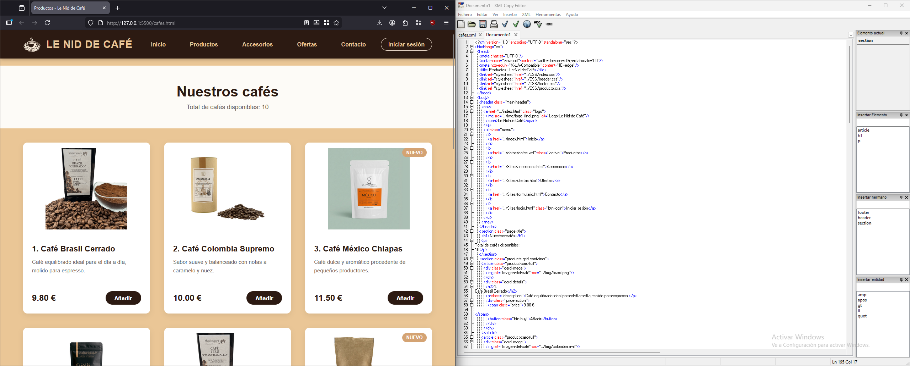

# Le Nid de Café ☕ 

## Descripción del Proyecto
**Le Nid de Café** es un sitio web dedicado a la **venta de café de especialidad, infusiones y accesorios relacionados**.  
El objetivo es que los clientes, tanto particulares como empresas, puedan ver nuestros productos de forma clara y comprar fácilmente online.

## Grupo 👥
**Nombre del Grupo:** Grupo 4 : david_adrian
*David: adbr222*
*Adrián: AdriAC6*

## 🗺️ Mapa del Sitio
- **index.html** → Página principal (inicio)
- **css/** → Carpeta que contiene las hojas de estilo (CSS)
- **img/** → Carpeta con las imágenes del sitio
- **Sites/**
  - **login.html** → Página de inicio de sesión
  - **ofertas.html** → Página de ofertas o promociones
  - **productos.html** → Página del catálogo de productos
  - **formulario.html** → Página del Formulario

## Recursos usados 🛠️
- HTML5
- Tipografía: *Playfair Display* y *Open Sans*  
- Paleta de colores cálidos: crema, caramelo y tonos de café  

## Estructura de Datos XML

### Descripción
El proyecto utiliza XML para estructurar el **catálogo de cafés** de la tienda, incluyendo información detallada de cada producto como origen, tueste, precio, stock y notas de sabor.

### Archivos
- **`/datos/cafes.xml`**: Contiene los datos de todos los cafés disponibles en la tienda.
- **`/datos/cafes.dtd`**: Validador DTD que asegura la estructura básica del XML.
- **`/datos/cafes.xsd`**: Schema XSD con restricciones avanzadas de tipos de datos, rangos, patrones y enumeraciones.
- **`/datos/validacion.md`**: Documentación completa del proceso de validación con DTD y XSD.

### Estructura principal
El XML tiene la siguiente estructura jerárquica:

- `<cafeteria>` (raíz)
  - Atributos opcionales: `nombre`, `xmlns:xsi`, `xsi:noNamespaceSchemaLocation`
  - `<cafes>` (contenedor de productos)
    - `<cafe>` (uno o más)
      - Atributos:
        - `id`: Identificador único con patrón CF seguido de 3 números.
        - `origen`: País o región de origen del café.
        - `tueste`: claro, medio u oscuro.
        - `molido`: booleano, indica si está molido.
        - `destacado`: booleano, indica si es un café destacado.
      - Elementos hijos:
        - `<nombre>`: Nombre del café.
        - `<descripcion>`: Descripción detallada.
        - `<precio>`: Precio en moneda local (decimal 5.00 a 50.00).
        - `<peso>`: Peso en gramos (entero positivo 100-1000).
        - `<stock>`: Cantidad disponible (entero 0-500).
        - `<fechaAlta>`: Fecha de alta en formato ISO (YYYY-MM-DD).
        - `<intensidad>`: Nivel de intensidad (entero 1-10).
        - `<notasSabor>`: Notas de sabor descriptivas.
        - `<etiquetas>`: Contenedor de `<etiqueta>` repetibles.
        - `<imagen>`: Ruta de la imagen dentro de `Img/`.

### Validación
La validación del XML se realiza con el DTD y el XSD.  
Ver documentación completa en [`/datos/validacion.md`](datos/validacion.md)

## Proceso de transformación documentado

### Archivos involucrados

- **`datos/cafes.xml`**: archivo XML de entrada con la información de los cafés.
- **`xslt/cafes-to-html.xsl`**: hoja de transformación XSLT utilizada para convertir el XML en HTML.
- **`cafes.html`**: archivo HTML generado como resultado de la transformación.

### Cómo ejecutar la transformación

**Opción 1. Navegador web**

Abrir el archivo `datos/cafes.xml` en un navegador que interprete la instrucción `xml-stylesheet`, de forma que el navegador aplique automáticamente la hoja `xslt/cafes-to-html.xsl` y muestre el resultado en HTML.

Después, se puede guardar o copiar el HTML generado como `cafes.html`.

**Opción 2. XML Copy Editor**

Abrir `cafes.xml` en XML Copy Editor, cargar la hoja `cafes-to-html.xsl` y ejecutar la transformación XSLT desde la propia aplicación para obtener el resultado final en HTML.

Una vez generada la salida, se guarda como `cafes.html`.

### Funcionalidades XSLT implementadas

En la hoja `cafes-to-html.xsl` se han implementado varias funcionalidades XSLT para transformar el archivo XML de cafés en una página HTML estructurada y visualmente integrada con el resto del sitio.

- **`xsl:output`**: define que la salida de la transformación sea un documento HTML con codificación UTF-8 y formato indentado.
- **`xsl:variable`**: declara la variable global `totalCafes` para almacenar el número total de cafés del XML.
- **`count()`**: cuenta todos los elementos `cafe` y permite mostrar el total de productos disponibles en la página.
- **`xsl:template`**: se han creado dos plantillas, una para la raíz del documento (`match="/"`) y otra para cada nodo `cafe`.
- **`xsl:apply-templates`**: aplica automáticamente la plantilla de cada café al conjunto de nodos seleccionados.
- **`xsl:sort`**: ordena los cafés por el valor del elemento `precio`, tratándolo como dato numérico.
- **`xsl:value-of`**: extrae y muestra valores del XML, como el nombre, la descripción, el precio, la imagen y el número de posición.
- **`xsl:attribute`**: genera dinámicamente el atributo `src` de la imagen de cada producto.
- **`xsl:text`**: añade texto fijo dentro de la construcción de la ruta de imagen, en este caso el prefijo `../`.
- **`xsl:if`**: muestra la etiqueta `Nuevo` únicamente en los cafés que tienen el atributo `destacado="true"`.
- **`position()`**: numera automáticamente cada café dentro del listado generado.

### Captura del resultado final

En la siguiente imagen se muestra el HTML generado a partir del XML y la hoja XSLT.

