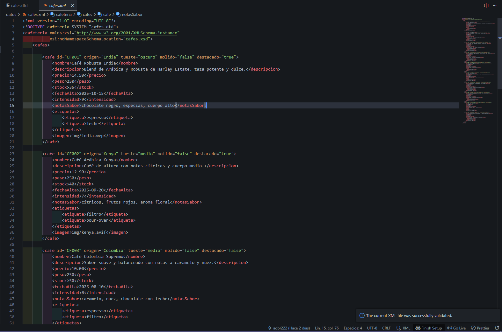
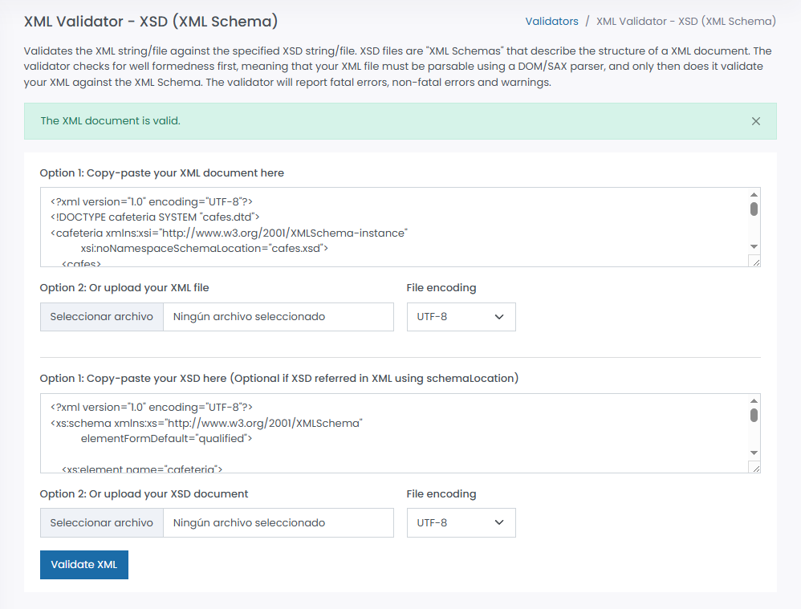

# Validación del archivo cafes.xml

## 1. Herramientas utilizadas

### Validación DTD

- Herramienta: XML Tools

### Validación XSD

- Herramienta: https://www.freeformatter.com/xml-validator-xsd.html

---

## 2. Proceso de validación

### Validación contra DTD

El archivo XML incluye la referencia al DTD mediante:

```xml
<!DOCTYPE cafeteria SYSTEM "cafes.dtd">
```

Esto permite validar automáticamente la estructura del documento según las reglas definidas.

El DTD valida:

- Elemento raíz `cafeteria`.
- Presencia obligatoria del elemento `cafes`.
- Uno o más elementos `cafe`.
- Orden estricto de elementos dentro de cada `cafe`.
- Atributos obligatorios:
  - id
  - origen
- Enumeraciones:
  - tueste (claro | medio | oscuro)
- Valores booleanos:
  - molido
  - destacado

> Nota: Se añadieron al DTD los atributos `xmlns:xsi` y `xsi:noNamespaceSchemaLocation` para permitir la validación conjunta con XSD:

```dtd
<!ATTLIST cafeteria
    nombre CDATA #IMPLIED
    xmlns:xsi CDATA #IMPLIED
    xsi:noNamespaceSchemaLocation CDATA #IMPLIED>
```

---

#### Pasos ejecutados:

- Hemos validado el DTD mediante la herramienta XML Tools. Y estos fueron los pasos a seguir:
- 1. Con el archivo XML abierto, hemos pulsado las teclas CTRL + SHIFT + P y hemos escrito "validate" para que nos saliese la opción.
- 2. Una vez salió la opción pulsamos en ella y automáticamente validará nuestro XML.
- 3. Comprobamos que está correctamente validado porque no saltó ningún error y en la parte inferior de la pantalla nos salió un mensaje que pondrá "The current XML file was successfully validated."

Resultado:

- El documento es válido según el DTD.
- La estructura y atributos cumplen las restricciones.

#### Captura de pantalla



---

## 3. Proceso de validación

### Validación contra XSD

El XML referencia el esquema XSD mediante:

```xml
xmlns:xsi="http://www.w3.org/2001/XMLSchema-instance"
xsi:noNamespaceSchemaLocation="cafes.xsd"
```

El esquema XSD añade validaciones más avanzadas:

#### Validación estructural

- Elemento raíz `cafeteria`.
- Elemento contenedor `cafes`.
- Múltiples elementos `cafe`.

#### Validación de atributos

- id obligatorio con patrón CF seguido de tres números.
- origen obligatorio.
- tueste con valores restringidos (claro, medio, oscuro).
- molido y destacado como booleanos.

#### Validación de tipos de datos

- precio: decimal entre 5.00 y 50.00.
- peso: entero positivo entre 100 y 1000.
- stock: entero entre 0 y 500.
- intensidad: entero entre 1 y 10.
- fechaAlta: formato fecha ISO (YYYY-MM-DD).
- imagen: ruta que empieza por "img/".

#### Pasos ejecutados:

- Hemos validado el XSD mediante el validador online "https://www.freeformatter.com/xml-validator-xsd.html".
- Copiamos el XML y el XSD dentro del validador
- Una vez copiados pulsaremos "Validate XML" y mostrará por pantalla el mensaje "The XML document is valid." Lo que nos mostrará que está perfectamente validado. 

Resultado:

- El documento cumple todas las restricciones definidas en el esquema.

#### Captura de pantalla



---

## 5. Decisiones de diseño

### ¿Por qué usar elementos vs atributos?

Se han utilizado atributos para representar información breve y descriptiva del café, mientras que los elementos contienen datos más complejos o extensos.

**Uso de atributos:**

- id: Identificador único del café.
- origen: Información simple y directa.
- tueste, molido, destacado: Características breves que describen el producto.

Ventajas:

- Facilitan la identificación rápida del elemento.
- Representan propiedades sin necesidad de estructura interna.

**Uso de elementos:**

- nombre
- descripcion
- precio
- notasSabor
- etiquetas

Ventajas:

- Permiten contenido más largo.
- Facilitan futuras ampliaciones.
- Mejor legibilidad y organización.

---

### Restricciones XSD aplicadas

#### 1. Restricción de patrón en ID

```xml
<xs:pattern value="CF[0-9]{3}"/>
```

Justificación:

- Garantiza un formato uniforme para los identificadores.
- Facilita la búsqueda y validación automática.

#### 2. Restricción de rango en precio

```xml
<xs:minInclusive value="5.00"/>
<xs:maxInclusive value="50.00"/>
```

Justificación:

- Evita valores fuera del rango lógico de precios.
- Asegura consistencia en los datos.

#### 3. Enumeración del atributo tueste

```xml
<xs:enumeration value="claro"/>
<xs:enumeration value="medio"/>
<xs:enumeration value="oscuro"/>
```

Justificación:

- Limita los valores posibles.
- Reduce errores de escritura.

#### 4. Validación de fecha (xs:date)

```xml
<xs:element name="fechaAlta" type="xs:date"/>
```

Justificación:

- Asegura formato estándar.
- Permite operaciones de ordenación temporal.

#### 5. Restricción de longitud en nombre y descripción

```xml
<xs:minLength value="3"/>
<xs:maxLength value="60"/>
```

Justificación:

- Evita textos demasiado cortos o excesivamente largos.
- Mejora la calidad y consistencia demlos datos.

#### 6. Restricción de decimales en precio

```xml
<xs:fractionDigits value="2"/>
```

Justificación:

- Limita el número de decimales permitidos.
- Mantiene dormato monetario correcto.


## 6. Conclusiones

 Realizamos algunos ajustes durante la validación ya que se detectó que el atributo `xsi:noNamespaceSchemaLocation` generaba un error en la validación DTD, ya que los atributos relacionados con namespaces no estaban declarados en el archivo DTD.

Para permitir la validación conjunta utilizando DTD y XSD, se añadieron los siguientes atributos opcionales al elemento `cafeteria` dentro del DTD:

```dtd
<!ATTLIST cafeteria
    nombre CDATA #IMPLIED
    xmlns:xsi CDATA #IMPLIED
    xsi:noNamespaceSchemaLocation CDATA #IMPLIED>
```

Este ajuste permite que el DTD reconozca los atributos del namespace XML Schema sin afectar a la estructura ni a las restricciones del documento XML. 
Por lo tanto, se ha validado correctamente el archivo XML mediante DTD y XSD

---

### Herramientas utilizadas

- Visual Studio Code con extensión XML Tools.
- Validadores online.

### Aspectos modificados durante el proceso:

- Ajuste del patrón del identificador para asegurar formato uniforme.
- Verificación de tipos de datos numéricos para cumplir los rangos definidos.
- Confirmación del orden exacto de los elementos exigido por el DTD.
- Declaración de atributos `xmlns:xsi` y `xsi:noNamespaceSchemaLocation` en el DTD para permitir la validación en conjunto de DTD + XSD.